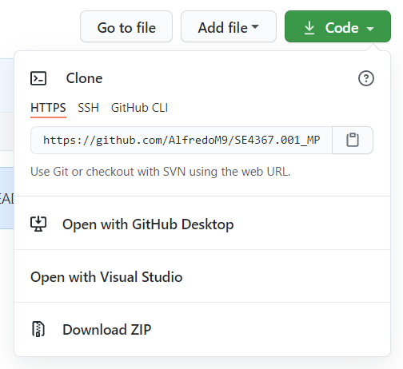
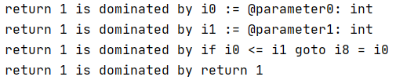
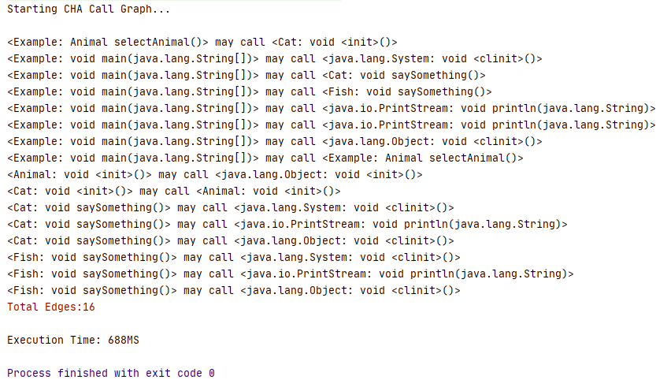
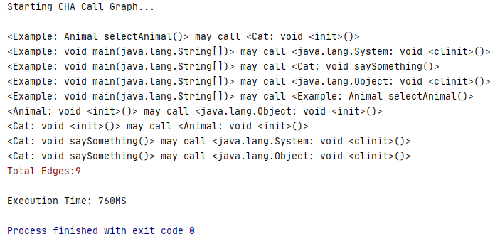
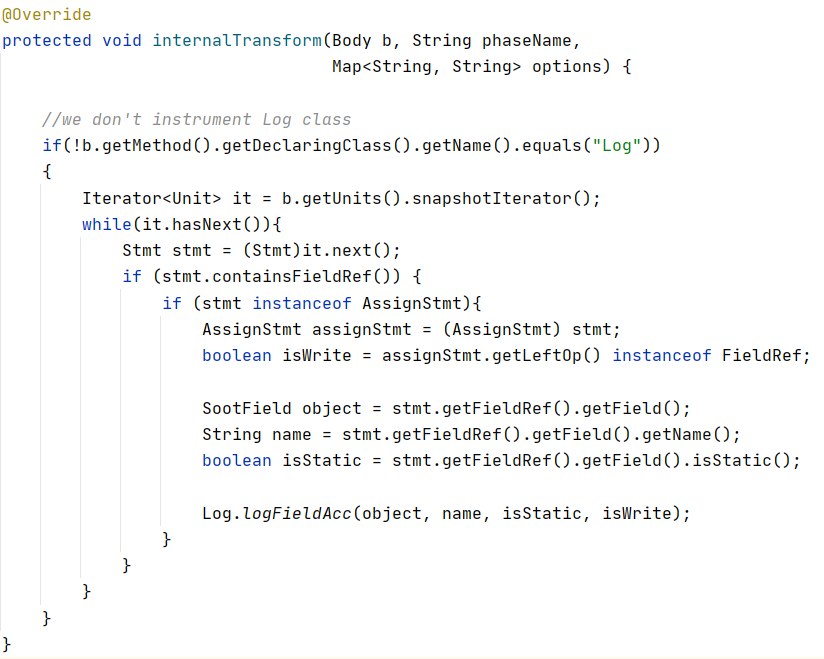
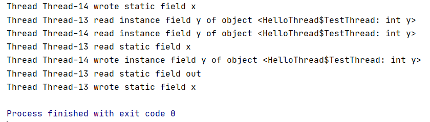
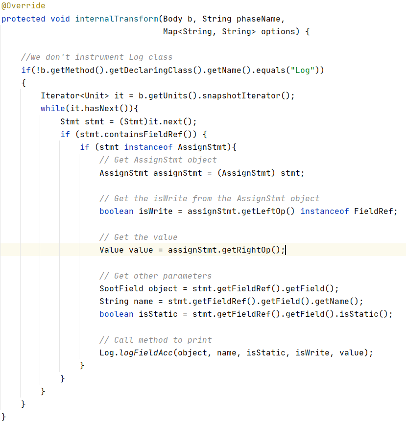
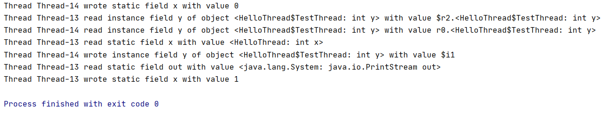

# Machine Problem 1

## Purpose
The purpose of this read me file is to further explain machine problem 1 (MP1). I will try to describe the actions I took 
to solve each question and give insights into what I learned.

First, you must download the code from my Git repo. In order to do that, you must go to my repo on Github. Click 
[here](https://github.com/AlfredoM9/SE4367.001_MP1) if you would like to go to my repo for MP1. Once you are in my repo, 
you click on "Code". This would bring up a set of options as shown in the image below.

You can either clone the repo into your local computer or download the zip folder and then extract the folder. After
this is done, you can easily open the project in an IDE and run the code given the configurations are set up correctly.

## Question 1

***Task:*** Given a method *m* and a statement *s*, to find all the statements in *m* that dominates *s*.

***Solution:*** The solution was already provided by the professor so the task for this problem is to determine if the
solution is correct and why do I think it is correct or incorrect. I think the solution is correct for various reasons.
The first reason is because I wrote the dominators of the GCD program by hand. Then I compared my answers to the output
produced by the TestDominatorFinder and the results were the same. For example, in the GCD program, there are three return 
statements, one inside an if  statement, another in an else statement, and then the last return statement is after and outside 
the if-else block. Inside the if statement there is a for loop and another if statement. So the dominator of that return statement 
is of course itself, the comparison of the if statement, the for loop, the outer if statement, and of course there is more but for
simplicity, we'll just stick with these. If we compare it with the output then it is the same. The output shows that the return statement is dominated by itself,
the branch meaning the if statement, the for loop and its comparisons, and the outer if statement. For the return statement inside 
the else, it is very similar as the else block also has a for loop and an if statement inside. Finally, the last return statement that
is outside the if-else block has different dominators because it doesn't have a for loop and a nested if statement that leads to that statement. So
one dominator for that specific return statement is the first variable initialization to 1 and the if statement that is checked before it reaches the return.
 The output supports that claim by showing the dominators being itself, the variable initialization to 1, the if statement and more. You can see the results outputted by the program below.

Another reason why I believe it is correct is because of the implementation
of the function. The way the function works at a high-level is that it constructs a control-graph. From this control-graph, it goes through
each node and tries to get the predecessors of that node. This makes sense as every predecessor of that node would mean it would have to pass
the predecessor node to get to the current node. Afterward, the function simply adds the current node to the list of dominators because
every node dominates itself. For this reason, I believe the implementation is correct. In the end, I think the function is correct because
it produces the right results, it uses the current algorithm, and it has the right theory to solve the problem. 
 

## Question 2

***Question:*** Which method does animal.saySomething() in the main method call?

***Answer:*** animal.saySomething() calls Cat.saySomething()

***Explanation:*** In order to figure out what class called what method or what class is calling the method of another class there must be a way
to analyze the program. One way to do this is by class hierarchy analysis (CHA). What CHA does is that at a call it identifies the type of the object
doing the call and all its subtypes such as children classes and returns all the methods named the same as the function being called. However, this is
not very accurate because a class may have many children with each child having a method named the same as the one being called. Yet, only one
child is being implemented but CHA will report all the methods with the same name are being called even though it belongs to different classes. 
This is why this isn't very precise. 

Another way is by using something that is called Points-to Analysis (PTA). The way that PTA works is that it will find out which object, the parent
object is referring to. It will then return the method with the same name as the one being called from the object it is referring to. A class can have many
subclasses however an object typically refers to one other object. This would mean the problem presented in CHA shouldn't appear when using PTA. PTA is 
considered more precise than CHA but the downfall is that PTA is often more complex than CHA. It needs to analyze the data flow in the whole program thus
taking more time and memory than CHA.

***Comparison:*** For part 2 we will compare both CHA and PTA on the Example.java program using the TestSootCallGraph.java. The expectation is for CHA 
to be quicker, however, as discussed previously it isn't very precise so the number of edges explored is going to be more because it may give false information. 
As discussed previously CHA may report some object is calling the method called when this isn't the case. PTA should take more time, however, because it is more
precise the number of edges should be lower. This is because the whole program analysis allows for PTA to get more accurate information regarding the program
and the object calling the method. This means PTA notes the number of nodes closer to what the actual program is producing compared to CHA due to its complexity.

To show the results of the program, the CHA and PTA outputted the number of nodes and their time to execute. Of course, for the time it may vary depending on 
the run but no matter the case almost always CHA was always quicker than PTA. The edges stayed the same no matter the run. One run of each
CHA and PTA are shown below.

As you can see CHA was quicker with more edges. The number of edges was 12 and the time varied between in the high 600s milliseconds or in the low 700s milliseconds. PTA, on the other
hand had fewer edges with 9 but needed more time to execute which was around 750 milliseconds. 

## Question 3

***Task:*** We are interested in logging every read and write statement that accesses data on the heap. So the task is to "write code to instrument every field access
in *HelloThread* to print out the access information. 

***Solution:*** In order to accomplish the task, we first must know what we have. The Log.java already has the implemented method called logFieldAcc to print the statements.
This method accepts 4 parameters. One is an object, the other is the name, the third is a boolean variable to determine if it's static, and the last is a 
boolean to determine if it is to write. In addition to this, we have a variable called stmt which is an Stmt object from the Soot API. This variable is going to help us 
get the information we want regarding each statement. The first thing I did, is that I went to look at the documentation and examples of the Soot API. Next, I consulted 
the TA regarding some questions I had about the Soot API. Finally, once I thought I had a solid understanding of how to accomplish this task, I started to code. Inside 
the if statement that says if stmt contains a field reference I added another if statement. This if statement is going to be true all the time for HelloThread but I added 
it as precautionary. The if statement checks if stmt is an instance of AssignStmt which will help us get the boolean to determine if it is to write. If it is true, then we
go inside and create an AssignStmt object. This object is initialized to a casted stmt for the AssignStmt object. From the AssignStmt object, we can now get the left op and determine if it is an instance
of the field reference. The boolean value returned will be assigned to the isWrite variable. The other variables are quite easy to get. You can easily use the stmt variable to 
get the object by first accessing the stmt.getFieldRef (Reference) and then return the getField. To get the name you access the reference, get the field, and then get the name. Lastly, 
for the isStatic variable, stmt also has a built-in isStatic method that returns a boolean value that determines if it is static or not. So we get the reference from stmt 
then get the field then access the is static method. The last part is to simply call the logFieldAcc method from Log.java and pass the appropriate parameters discovered previously. 

My implementation is given below.

The results of my implementation is given below as well. 

***Bonus:*** I tried to tackle the bonus problem. I'm not sure if I implemented correctly, however, the task was to get the value of each read and write access.
So what I did was I used the AssignStmt object which was discussed previously. I used the AssignStmt object to get the right 
operation. I'm assuming that is the value because typically the value of a variable is on the right side. So I simply stored the return
value of the AssignStmt.getRightOp() into a variable and passed all the arguments including this one into the Log.logFieldAcc method.

My implementation and results are shown below. 

### Questions

If you have any questions, please feel free to contact me. Thank you.